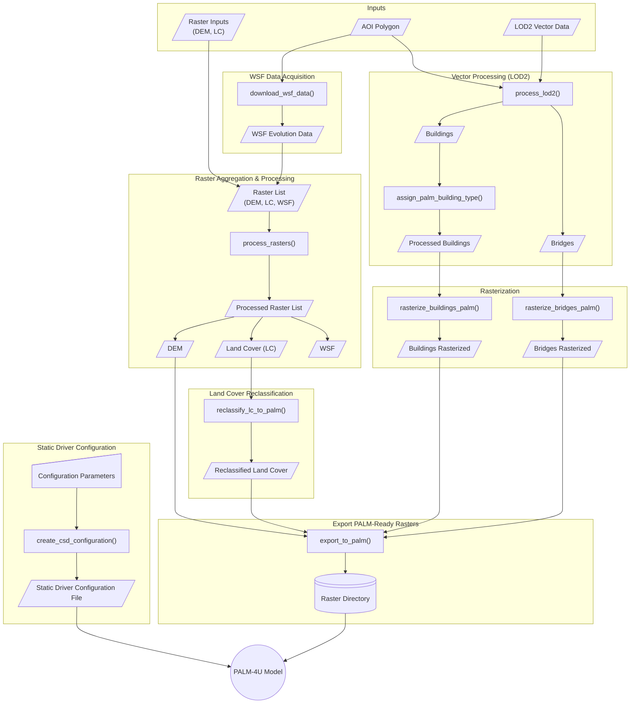

# PALMPrepR
This R Package is the final submission of the Course "Introduction to Programming and Geostatistics" within the [EAGLE Master's Program](https://eagle-science.org/).

## Overview

PALMPrepR is an R package that provides a comprehensive workflow for downloading, preprocessing, and rasterizing geospatial datasets required to generate basic static driver input files for the **PALM-4U** urban climate model. A function to create the required configuration file for the PALM-specific static driver is included to simplify the workflow.

This package is a work in progress. More features will come soon with functions supporting proper representation of  three-dimensional urban features (e.g. urban trees and LOD2 building data) through voxelization, more download and preprocessing functions of additional datasets (e.g. OSM), street types for parametrization of emissions, and reclassification functions for the whole PALM surface type palette.


## Features
- **Area of Interest (AOI) support**: Work with custom geographic areas defined by polygon boundaries
- **Download geospatial data**: Download WSF Evolution tiles intersecting an AOI including merging and clipping to AOI
- **Preprocessing**: Reprojection, resampling, and clipping of raster datasets to a common grid
- **Reclassification** of land-cover data to PALM surface types
- Building classification by **ALKIS** codes and construction year (via WSF as proxy for construction year)  
- **Rasterization**: of vector data (buildings, bridges) into raster formats compatible with PALM-4U
- **Configuration management**: Generation of a YAML static driver configuration file for further processing with PALM-4U  

## Installation

To install PALMPrepR, use:

```r
devtools::install_github("davidvoellner/PALMPrepR")
```

## Dependencies

PALMPrepR requires the following R packages, which are shipped with the package:
- `sf` - Simple features for geospatial data
- `terra` - Spatial raster and vector data handling
- `httr` - HTTP requests for downloading data
- `curl` - URL handling

## Main Functions

### Data Download
- `download_wsf_data()` - Download World Settlement Footprint Evolution raster data

### Raster Processing
- `process_lod2()` - Process LOD2 building data
- `process_rasters()` - Process raster datasets
- `reclassify_lc_to_palm()` - Reclassify land cover data for PALM-4U

### LOD2 Data Processing
- `assign_palm_building_type()` - Assign building type classifications
- `rasterize_buildings_palm()` - Rasterize building footprints with attributes
- `rasterize_bridges_palm()` - Process bridge data for PALM-4U

### Static Driver Preparation
- `export_to_palm()` - Export processed data to PALM-4U format
- `create_csd_configuration()` - Generate CSD configuration files


## Example Workflow

This example demonstrates a complete PALMPrepR workflow using sample data included in the package. The workflow processes building and raster data for a test area of interest and prepares it along a static driver configuration file to be further processed as PALM-specific static driver.

### Step 1: Load the Package and Sample Data

```r

```

### Step 2: Process Building Data

```r

```

### Step 3: Process Raster Data

```r

```

### Step 4: Process Additional Features

```r

```

### Step 5: Create CSD Configuration and Export

```r

```
---

---
## Documentation

For a more detailed documentation on individual functions, use the standard R help:

```r
?function_name
```

## License

This package is licensed under the GNU General Public License v3.0 or later. See [LICENSE.md](LICENSE.md) for details.

## Author

David Voellner


## Contributing

Contributions are welcome! Please feel free to submit issues or pull requests.
