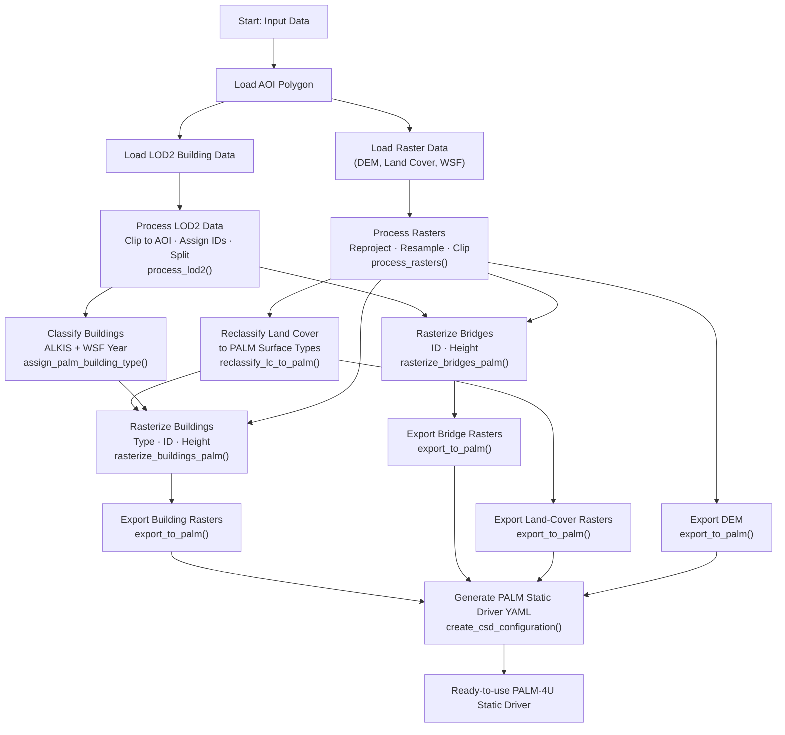
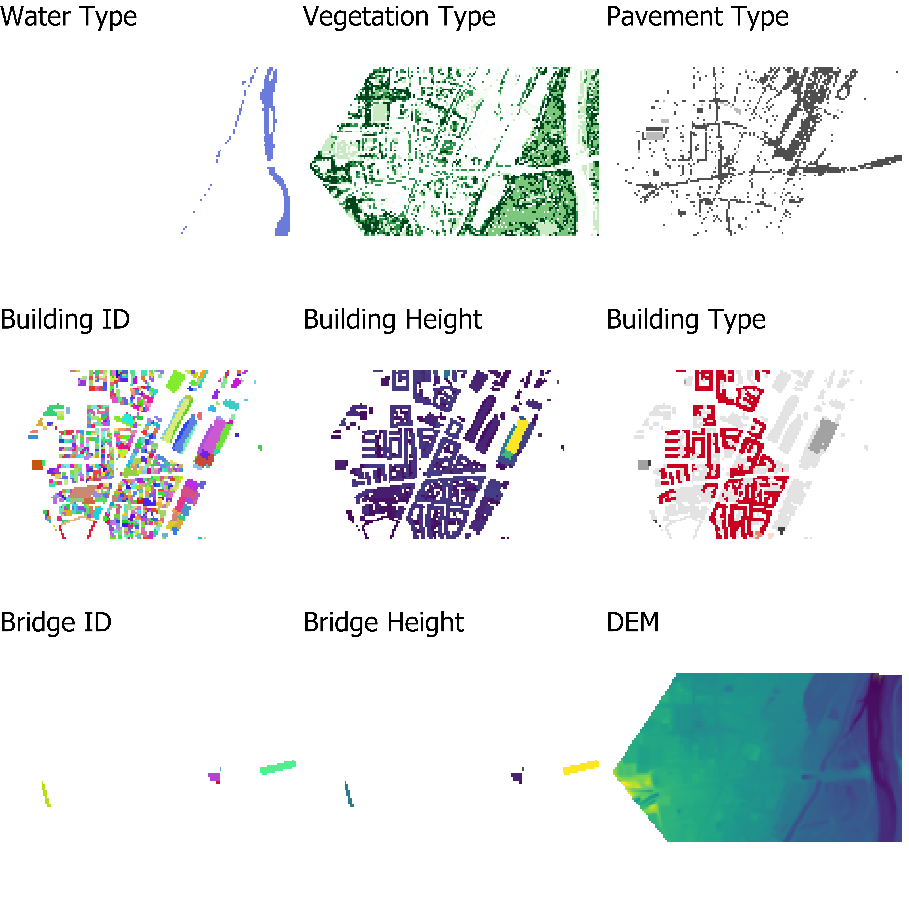

# PALMPrepR

## Overview

PALMPrepR is an R package that provides a comprehensive workflow for downloading, preprocessing, and rasterizing geospatial datasets required to generate static driver input files for the **PALM-4U** urban climate model.

PALM-4U is an advanced urban climate simulation model used for modeling atmospheric processes in urban areas. This package streamlines the often complex data preparation pipeline, automating the collection and processing of geospatial data such as buildings, land cover, digital elevation models, and other environmental features.

## Features

- **Download geospatial data**: World Settlement Footprint data
- **Preprocessing**: Clean, validate, and standardize geospatial data to PALM-4U requirements
- **Rasterization**: Convert vector data (buildings, bridges, land cover) into raster formats compatible with PALM-4U
- **Configuration management**: Create PALM-4U CSD (Static Driver Configuration) files
- **Area of Interest (AOI) support**: Work with custom geographic areas defined by polygon boundaries


## Features
- Download function for the WSF Evolution tiles intersecting an AOI including merging and clipping to AOI
- Reprojection, resampling, and clipping of raster datasets to a common grid
- Automated land-cover reclassification to PALM surface types  
- Processing of LOD2 data
- Building classification by ALKIS codes and construction year (via WSF as proxy for construction year)  
- Rasterization of buildings and bridges (type, ID, height)  
- Export of GeoTIFFs following PALM static driver conventions  
- Automatic generation of a YAML static driver configuration file  

## Workflow


## Installation

To install PALMPrepR, use:

```r
devtools::install_github("davidvoellner/PALMPrepR")
```

## Dependencies

PALMPrepR requires the following R packages:
- `sf` - Simple features for geospatial data
- `terra` - Spatial raster and vector data handling
- `httr` - HTTP requests for downloading data
- `curl` - URL handling
- `osmdata` - OpenStreetMap data access

## Main Functions

### Data Download
- `download_lod2_buildings()` - Download Level of Detail 2 building footprints
- `download_wsf_data()` - Download World Settlement Footprint raster data

### Processing
- `process_lod2()` - Process LOD2 building data
- `process_rasters()` - Process raster datasets
- `reclassify_lc_to_palm()` - Reclassify land cover data for PALM-4U

### Building Data
- `assign_palm_building_type()` - Assign building type classifications
- `rasterize_buildings_palm()` - Rasterize building footprints with attributes

### Utilities
- `rasterize_bridges_palm()` - Process bridge data for PALM-4U
- `export_to_palm()` - Export processed data to PALM-4U format
- `create_csd_configuration()` - Generate CSD configuration files

## Quick Start

```r
library(PALMPrepR)

# Define your area of interest (as sf polygon)
aoi <- sf::read_sf("path/to/aoi.gpkg")

# Download and process building data
buildings <- download_lod2_buildings(aoi)
buildings_processed <- process_lod2(buildings, aoi)
buildings_raster <- rasterize_buildings_palm(buildings_processed, aoi)

# Download and process raster data
wsf <- download_wsf_data(aoi)
rasters_processed <- process_rasters(wsf, aoi)

# Export to PALM-4U format
export_to_palm(buildings_raster, rasters_processed, output_dir = "palm_input")
```




## Example Workflow

This example demonstrates a complete PALMPrepR workflow using sample data included in the package. The workflow processes building and raster data for a test area of interest and prepares it for PALM-4U simulation.

### Step 1: Load the Package and Sample Data

```r
library(PALMPrepR)
library(sf)
library(terra)

# Load the test area of interest
aoi <- sf::read_sf(system.file("extdata/test_aoi.gpkg", package = "PALMPrepR"))

# Display the AOI
plot(aoi)
```

### Step 2: Process Building Data

```r
# Load LOD2 building footprints
buildings <- sf::read_sf(system.file("extdata/lod2_multipolygon.gpkg", package = "PALMPrepR"))

# Process the building data
buildings_processed <- process_lod2(buildings, aoi)

# Assign building types
buildings_typed <- assign_palm_building_type(buildings_processed)

# Rasterize to PALM-4U format
buildings_raster <- rasterize_buildings_palm(buildings_typed, aoi, resolution = 10)

# Inspect the rasterized buildings
plot(buildings_raster)
```

### Step 3: Process Raster Data

```r
# Load pre-processed raster data
rasters_data <- readRDS(system.file("extdata/processed_rasters.rds", package = "PALMPrepR"))

# Process and prepare rasters for PALM-4U
rasters_processed <- process_rasters(rasters_data, aoi)

# Check raster dimensions and resolution
print(rasters_processed)
```

### Step 4: Process Additional Features

```r
# Load and process bridge data
bridges <- sf::read_sf(system.file("extdata/processed_bridges.gpkg", package = "PALMPrepR"))

# Rasterize bridges for PALM-4U
bridges_raster <- rasterize_bridges_palm(bridges, aoi, resolution = 10)

# Reclassify land cover to PALM-4U categories
# (This assumes you have loaded raster land cover data)
lc_palm <- reclassify_lc_to_palm(rasters_processed$lc)
```

### Step 5: Create CSD Configuration and Export

```r
# Create a CSD (Configuration Static Driver) file
csd_config <- create_csd_configuration(
  buildings = buildings_raster,
  rasters = rasters_processed,
  output_dir = "output",
  domain_name = "test_domain"
)

# Export all processed data to PALM-4U format
export_to_palm(
  buildings = buildings_raster,
  rasters = rasters_processed,
  output_dir = "palm_input"
)

# Check the output directory
list.files("palm_input", recursive = TRUE)
```

### Complete Example Output Structure

After running the full workflow, your PALM-4U input directory will contain:

```
palm_input/
├── buildings/
│   └── buildings.nc
├── rasters/
│   ├── dem.nc
│   ├── lc.nc
│   └── wsf.nc
├── configuration/
│   └── csd_config.yml
└── metadata/
    └── processing_info.txt
```

## Documentation

For detailed documentation on individual functions, use the standard R help:

```r
?function_name
```

HTML documentation is also available in the package documentation.

## License

This package is licensed under the GNU General Public License v3.0 or later. See [LICENSE.md](LICENSE.md) for details.

## Author

David Voellner


## Contributing

Contributions are welcome! Please feel free to submit issues or pull requests.
