# PALMPrepR
This R Package is was created as a final project for the course "Introduction to Programming and Geostatistics" on the [EAGLE Master's Program](https://eagle-science.org/).

## Overview

PALMPrepR is an R package that provides a comprehensive workflow for downloading, preprocessing, and rasterizing geospatial datasets required to create static driver input files for the **PALM-4U** urban climate model. A function to create the required configuration file for the PALM-specific static driver is included to simplify the data-transfer to a PALM-4U simulation.

This package is a work in progress. More features will come soon with functions supporting proper representation of three-dimensional urban features (e.g. urban trees and LOD2 building data) through voxelization, more download and preprocessing functions of additional datasets (e.g. OSM), street types for parametrization of emissions, and more flexible classification functions for other input classification schemes (e.g. CORINE Land Cover) and the whole palm surface type palette. Currently the tree download function is restricted to bavaria, as the bavarian open geodata portal is the only one implemented in the download options yet.

## Features
- **Area of Interest (AOI) support**: Work with custom geographic areas defined by polygon boundaries
- **Download geospatial data**: Download WSF Evolution tiles and single tree locations intersecting an AOI
- **Preprocessing**: Reprojection, resampling, and clipping of raster datasets to a common grid
- **Reclassification** of land-cover data to PALM surface types
- **Building classification** by ALKIS codes and construction year (via WSF as proxy for construction year)
- **Rasterization** of vector data (buildings, bridges, trees) into raster data compatible with PALM-4U
- **Configuration management**: Generation of a YAML static driver configuration file for further processing with PALM-4U  

## Installation

To install PALMPrepR, use:

```r
devtools::install_github("davidvoellner/PALMPrepR")
```

## Dependencies

PALMPrepR requires the following R packages, which are shipped with the package:
- `sf` - Simple features for geospatial data
- `terra` - Spatial raster and vector data handling
- `httr` - HTTP requests for downloading data
- `curl` - URL handling

## Main Functions

### Data Download
- `download_wsf_raster()` - Download World Settlement Footprint Evolution raster data from [EOC Geoservice](https://geoservice.dlr.de/web/datasets/wsf_evo)
- `download_trees()` - Download single tree location and height vector data from [geodaten.bayern.de](https://geodaten.bayern.de/opengeodata/OpenDataDetail.html?pn=einzelbaeume&active=DOWNLOAD)

### Raster Processing
- `process_lod2()` - Process LOD2 building data
- `prepare_raster_stack()` - Stack raster datasets using a common grid
- `classify_lc_to_palm()` - Reclassify land cover data for PALM-4U

### LOD2 Data Processing
- `classify_buildings_to_palm` - Classify building types for PALM-4U
- `rasterize_buildings_to_palm()` - Rasterize building footprints with attributes
- `rasterize_bridges_to_palm()` - Process bridge data for PALM-4U

### Tree Processing
- `rasterize_trees_to_palm()` - Rasterize tree attribute for PALM-4U

### Static Driver Preparation
- `export_to_palm()` - Export processed data to PALM-4U format
- `build_csd_configuration()` - Create CSD configuration file

### Overview Exported Data

<table>
  <tr>
    <th>DEM</th>
    <th>Vegetation Type</th>
    <th>Pavement Type</th>
  </tr>
  <tr>
    <td>
      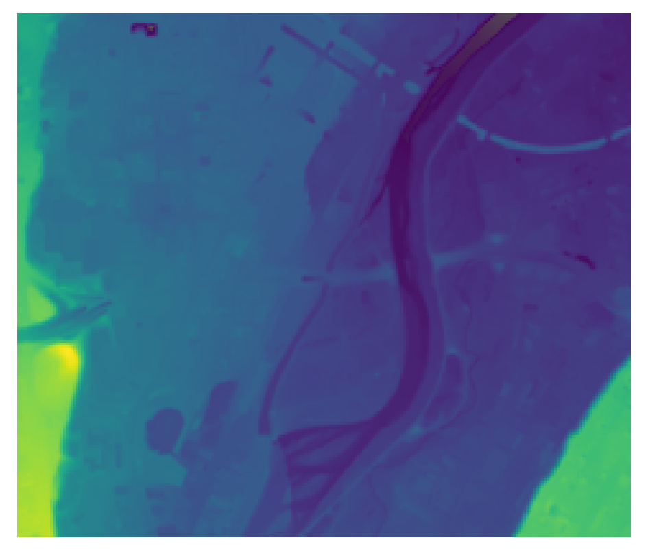
    </td>
    <td>
      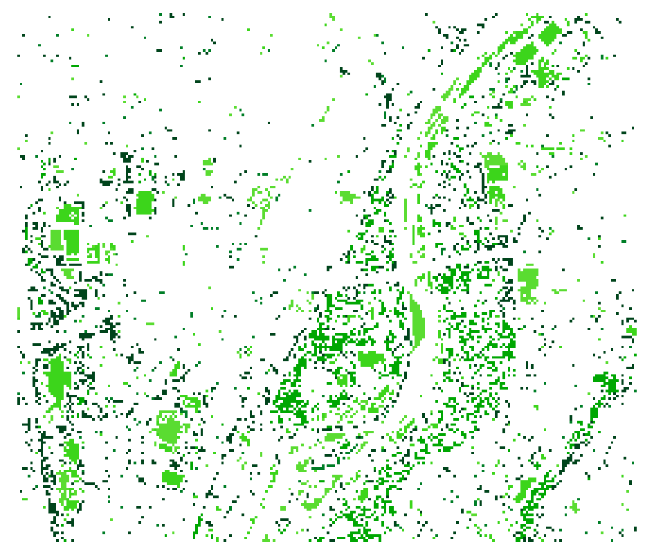
    </td>
    <td>
      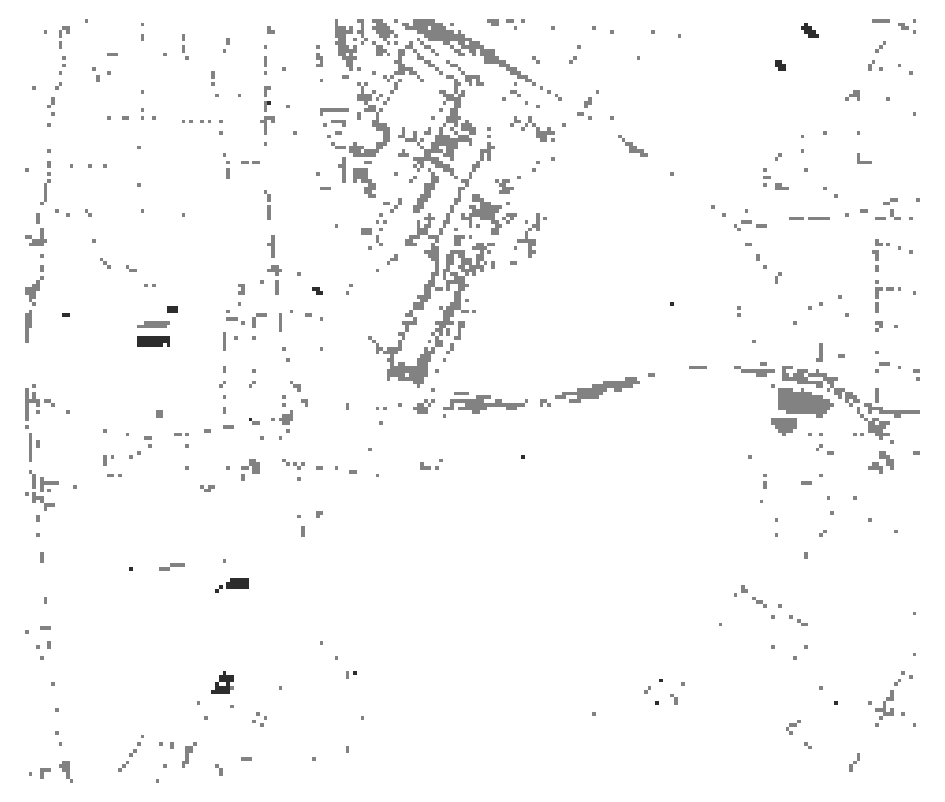
    </td>
  </tr>

  <tr>
    <th>Water Type</th>
    <th>Building Height</th>
    <th>Building Type</th>
  </tr>
  <tr>
    <td>
      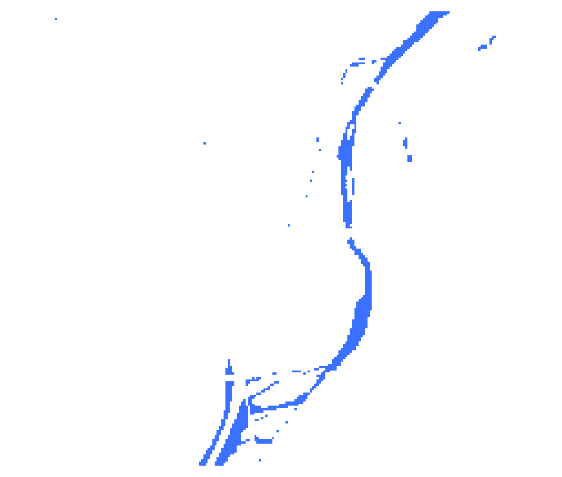
    </td>
    <td>
      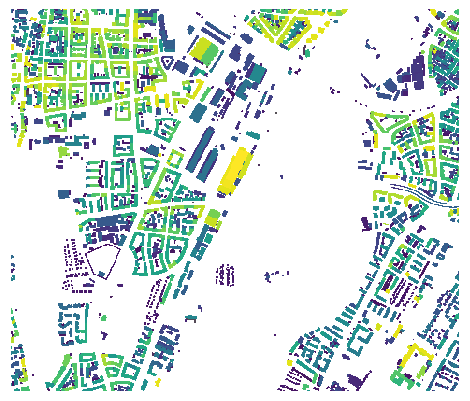
    </td>
    <td>
      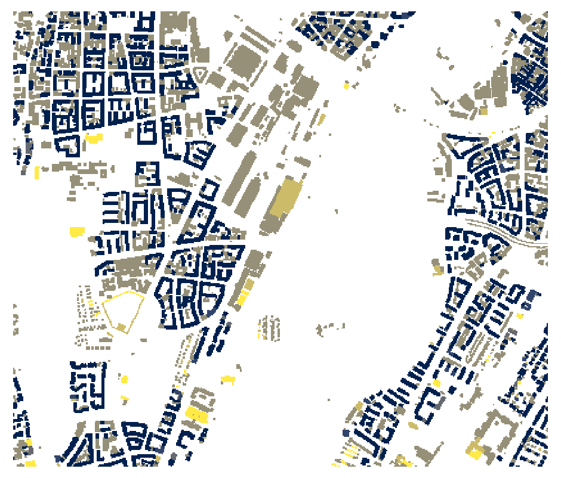
    </td>
  </tr>

  <tr>
    <th>Building ID</th>
    <th>Bridge Height</th>
    <th>Bridge ID</th>
  </tr>
  <tr>
    <td>
      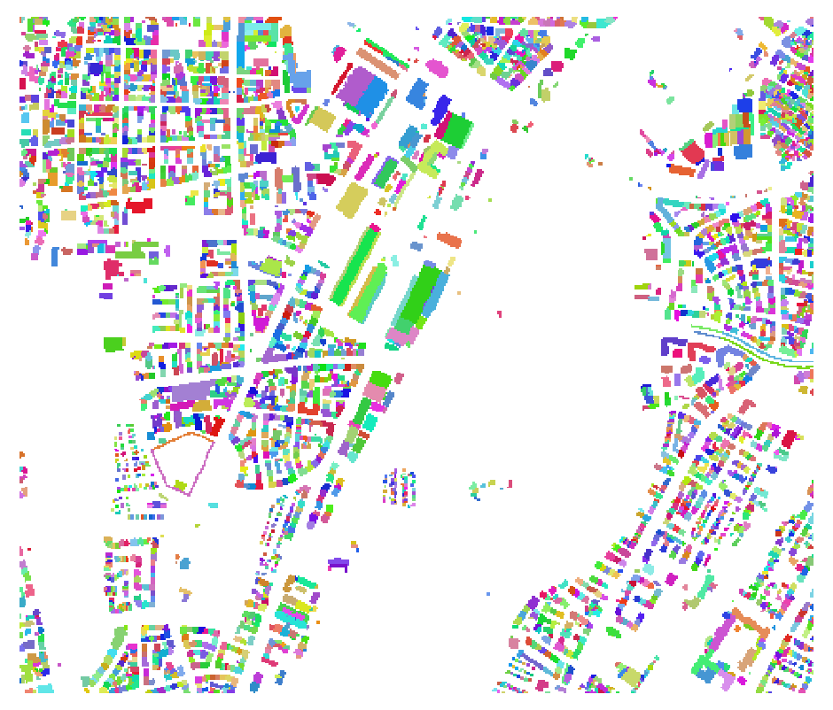
    </td>
    <td>
      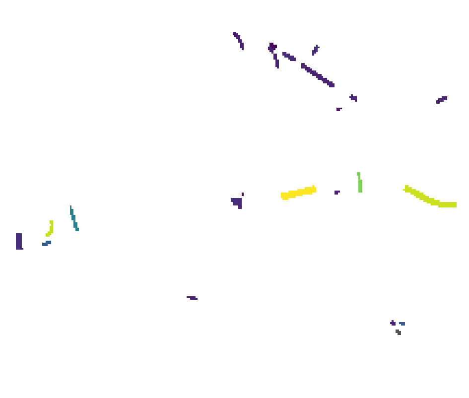
    </td>
    <td>
      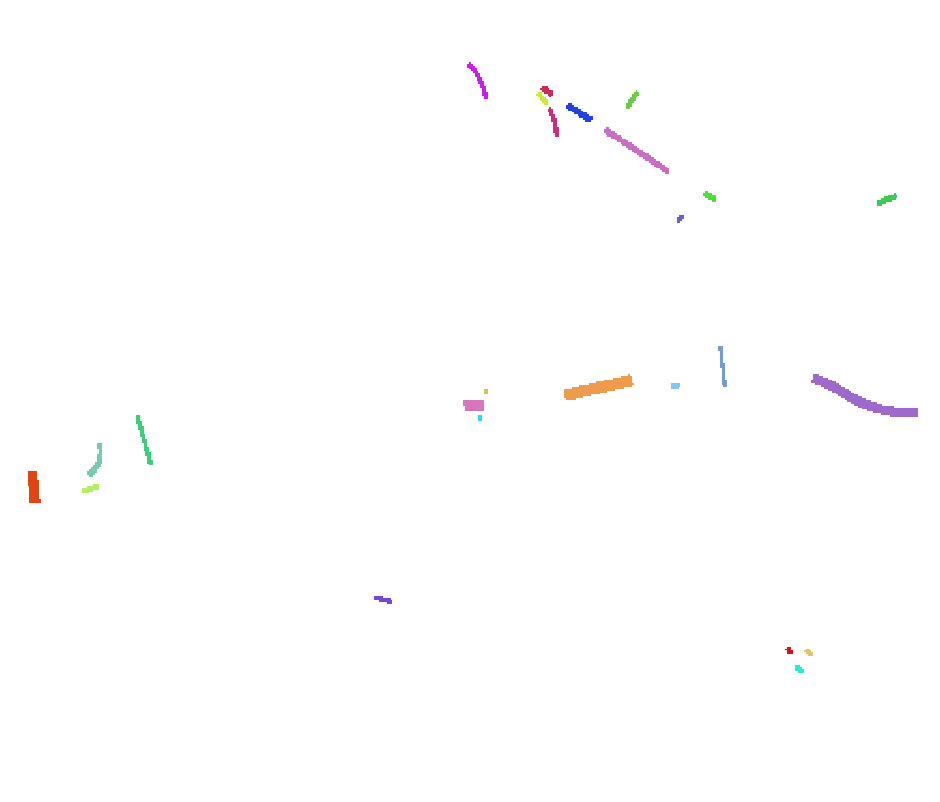
    </td>
  </tr>

  <tr>
    <th>Tree Height</th>
    <th>Tree Type</th>
    <th>Configuration File</th>
  </tr>
  <tr>
    <td>
      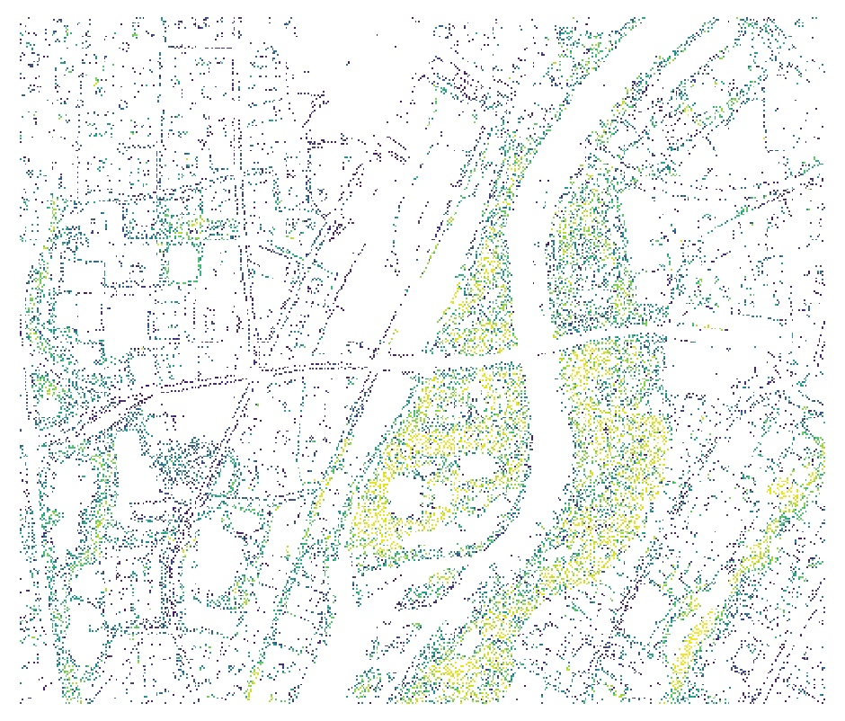
    </td>
    <td>
      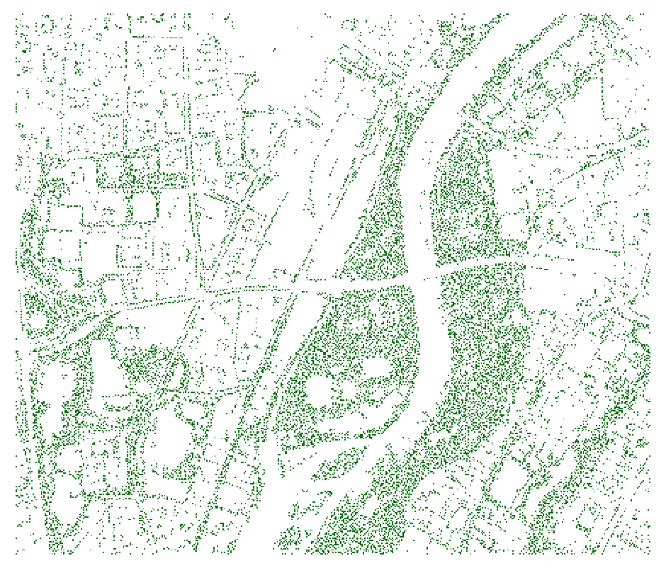
    </td>
    <td>
      <a href="img/test_csd_configuration.yml">csd_configuration.yml</a>
    </td>
  </tr>
</table>

## Example Workflow

This example demonstrates a complete PALMPrepR workflow using sample data included in the package. The workflow downloads and processes data for a test area of interest and prepares it along a static driver configuration file to be further used as a PALM-specific static driver for microclimatic simulations.

### Load Packages
```r
library(PALMPrepR)
library(sf)
library(terra)
```

### Load Sample Data
```r
# AOI
aoi <- st_read(system.file("extdata", "aoi_10.gpkg", package = "PALMPrepR"))

# Load Landcover and DEM raster data
lc  <- rast(system.file("extdata", "LC_5.tif", package = "PALMPrepR"))
dem <- rast(system.file("extdata", "DEM_5.tif", package = "PALMPrepR"))
```

### Download [World Settlement Footprint (WSF®) Evolution](https://geoservice.dlr.de/web/datasets/wsf_evo) tiles and Tree data
```r
# Download data
wsf <- download_wsf_raster(aoi)
trees <- download_trees(aoi)
```

### Process Raster Data
```r
# Create named list of raster for processing
raster_list <- list(
  dem = dem,
  lc  = lc,
  wsf = wsf
)

# Process list of raster to common grid (10 m, EPSG:25832)
resolution = 10
target_epsg = 25832
aligned_raster <- prepare_raster_stack(
  aoi = aoi,
  target_epsg = target_epsg,
  resolution = resolution,
  data = raster_list
)

# Reclassify Land Cover to PALM surface types
lc_palm <- classify_lc_to_palm(
  data = aligned_raster$lc
)
```

### Process Building Data
```r
# Load example data
lod2_data <- st_read(system.file("extdata", "lod2_multipolygon.gpkg", package = "PALMPrepR"))

# Process LOD2 data: clip to AOI, assign IDs, split into buildings/bridges layers
lod2 <- process_lod2(
  data = lod2_data,
  aoi = aoi
)

# Classify buildings by ALKIS codes and WSF construction year to PALM Building types
lod2$buildings <- classify_buildings_to_palm(
  buildings = lod2$buildings,
  wsf       = aligned_raster$wsf
)
```

### Rasterize data
```r
# Rasterize building properties (type, ID, height)
building_raster <- rasterize_buildings_to_palm(
  buildings = lod2$buildings,
  template  = aligned_raster$dem
)

# Rasterize bridge properties (ID, height)
bridge_raster <- rasterize_bridges_to_palm(
  bridges  = lod2$bridges,
  template = aligned_raster$dem
)

# Rasterize tree attributes (height, type)
tree_raster <- rasterize_trees_to_palm(
  trees = trees,
  template = aligned_raster$dem,
  tree_type = 0
)
```

### Export data
```r
# Export processed data to GeoTIFF with PALM naming convention
export_dir <- "<path_to>/static_driver_export"
prefix <- "test"
resolution <- 10 #just the suffix - does NOT affect the actual resolution

# Export DEM (base raster)
export_to_palm(
  list(dem = aligned_raster$dem),
  export_dir, prefix, resolution
)

# Export Land Cover surface types
export_to_palm(
  list(
    vegetation_type = lc_palm$vegetation,
    water_type = lc_palm$water,
    pavement_type = lc_palm$pavement
  ),
  export_dir, paste0(prefix, "_lc"), resolution
)

# Export building raster
export_to_palm(
  list(
    building_type = building_raster$type,
    building_id = building_raster$id,
    building_height = building_raster$height
  ),
  export_dir, prefix, resolution
)

# Export bridge raster
export_to_palm(
  list(
    bridge_id = bridge_raster$id,
    bridge_height = bridge_raster$height
  ),
  export_dir, prefix, resolution
)

# Export tree raster
export_to_palm(
  list(
    tree_type = tree_raster$type,
    tree_height = tree_raster$height
  ),
  export_dir, prefix, resolution
)
```
### Create CSD Configuration and Export

```r
# Build YAML static driver configuration file
config_path <- build_csd_configuration(
  prefix = prefix,
  output_dir = export_dir,
  
  # --- Attributes ---
  author = "Author <author@example.com>",
  contact_person = "Contact Person <contact@example.com>",
  acronym = prefix,
  data_content = "Example Static Driver for PALM4U, 10 m resolution",
  location = "Example Location",
  institution = "Example Institution",
  
  # --- Settings ---
  epsg = target_epsg,
  season = "summer",
  
  # --- Output ---
  output_path = paste0("/", prefix, "_static_driver"),
  file_out = paste0(prefix, "_static_driver"),
  version = 1,
  
  # --- Input root directory ---
  input_root_path = export_dir,
  
  # --- Domain ---
  pixel_size = resolution,
  origin_x = 686750,
  origin_y = 5335300,
  nx = 39,
  ny = 39,
  dz = 10
)
```
---
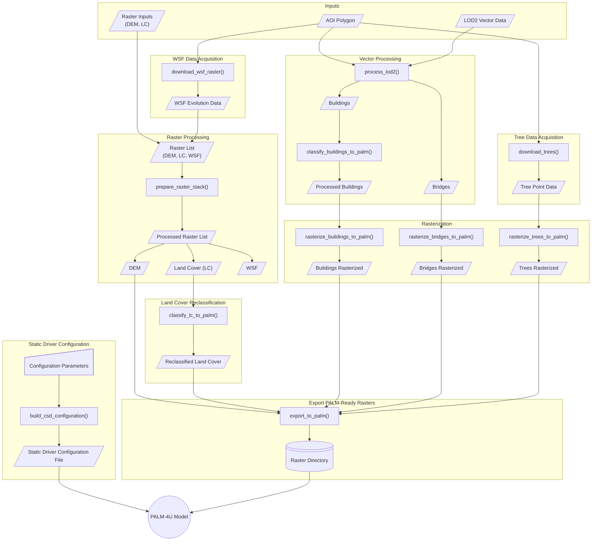
```mermaid
flowchart TD

    %% =====================================================
    %% Inputs
    %% =====================================================
    subgraph INPUTS["Inputs"]
        AOI@{shape: lean-r, label: "AOI Polygon"}
        RASTER_SRC@{shape: lean-r, label: "Raster Inputs<br/>(DEM, LC)"}
        LOD2@{shape: lean-r, label: "LOD2 Vector Data"}
    end

    %% =====================================================
    %% WSF Acquisition
    %% =====================================================
    subgraph WSF_ACQ["WSF Data Acquisition"]
        DL_WSF@{shape: rect, label: "download_wsf_raster()"}
        WSF_RAW@{shape: lean-r, label: "WSF Evolution Data"}
        AOI --> DL_WSF --> WSF_RAW
    end

    %% =====================================================
    %% Tree Acquisition
    %% =====================================================
    subgraph TREE_ACQ["Tree Data Acquisition"]
        DL_TREE@{shape: rect, label: "download_trees()"}
        TREE_RAW@{shape: lean-r, label: "Tree Point Data"}

        AOI --> DL_TREE --> TREE_RAW
    end

    %% =====================================================
    %% Raster Aggregation & Processing
    %% =====================================================
    subgraph RASTER_PROC["Raster Processing"]
        RASTER_LIST@{shape: lean-r, label: "Raster List<br/>(DEM, LC, WSF)"}
        PROCESS_RASTER@{shape: rect, label: "prepare_raster_stack()"}
        RASTER_PROCESSED@{shape: lean-r, label: "Processed Raster List"}

        RASTER_SRC --> RASTER_LIST
        WSF_RAW --> RASTER_LIST
        RASTER_LIST --> PROCESS_RASTER --> RASTER_PROCESSED

        DEM@{shape: lean-r, label: "DEM"}
        LC@{shape: lean-r, label: "Land Cover (LC)"}
        WSF@{shape: lean-r, label: "WSF"}

        RASTER_PROCESSED --> DEM
        RASTER_PROCESSED --> LC
        RASTER_PROCESSED --> WSF
    end

    %% =====================================================
    %% Land Cover Reclassification
    %% =====================================================
    subgraph LC_RECLASSIFY["Land Cover Reclassification"]
        RECLASS_LC@{shape: rect, label: "classify_lc_to_palm()"}
        LC_RECLASS@{shape: lean-r, label: "Reclassified Land Cover"}
        LC --> RECLASS_LC --> LC_RECLASS
    end

    %% =====================================================
    %% Vector Processing (LOD2)
    %% =====================================================
    subgraph VECTOR_PROC["Vector Processing"]
        VECTOR_PROC_FN@{shape: rect, label: "process_lod2()"}
        BUILDINGS@{shape: lean-r, label: "Buildings"}
        BRIDGES@{shape: lean-r, label: "Bridges"}

        AOI --> VECTOR_PROC_FN
        LOD2 --> VECTOR_PROC_FN
        VECTOR_PROC_FN --> BUILDINGS
        VECTOR_PROC_FN --> BRIDGES

        BUILD_TYPE@{shape: rect, label: "classify_buildings_to_palm()"}
        BUILDINGS_PROC@{shape: lean-r, label: "Processed Buildings"}

        BUILDINGS --> BUILD_TYPE --> BUILDINGS_PROC
    end

    %% =====================================================
    %% Rasterization
    %% =====================================================
    subgraph RASTERIZE["Rasterization"]
        BUILD_RAST@{shape: rect, label: "rasterize_buildings_to_palm()"}
        BRIDGE_RAST@{shape: rect, label: "rasterize_bridges_to_palm()"}
        TREE_RAST@{shape: rect, label: "rasterize_trees_to_palm()"}

        BUILD_RASTD@{shape: lean-r, label: "Buildings Rasterized"}
        BRIDGES_RASTD@{shape: lean-r, label: "Bridges Rasterized"}
        TREES_RASTD@{shape: lean-r, label: "Trees Rasterized"}

        BUILDINGS_PROC  --> BUILD_RAST  --> BUILD_RASTD
        BRIDGES         --> BRIDGE_RAST --> BRIDGES_RASTD
        TREE_RAW        --> TREE_RAST   --> TREES_RASTD
    end

    %% =====================================================
    %% Export PALM-Ready Data
    %% =====================================================
    subgraph EXPORTS["Export PALM-Ready Rasters"]
        EXPORT@{shape: rect, label: "export_to_palm()"}
        RAST_DIR@{shape: lin-cyl, label: "Raster Directory"}

        DEM --> EXPORT
        LC_RECLASS --> EXPORT
        BUILD_RASTD --> EXPORT
        BRIDGES_RASTD --> EXPORT
        TREES_RASTD --> EXPORT

        EXPORT --> RAST_DIR
    end

    %% =====================================================
    %% Static Driver Configuration
    %% =====================================================
    subgraph CONFIG["Static Driver Configuration"]
        CONFIG_INFO@{shape: sl-rect, label: "Configuration Parameters"}
        CSD_CONFIG@{shape: rect, label: "build_csd_configuration()"}
        YML_FILE@{shape: lean-r, label: "Static Driver Configuration File"}

        CONFIG_INFO --> CSD_CONFIG --> YML_FILE
    end

    %% =====================================================
    %% PALM-4U Model Execution
    %% =====================================================
    PALM@{shape: circle, label: "PALM-4U Model"}
    YML_FILE --> PALM
    RAST_DIR --> PALM
```
---
## Documentation
For a more detailed documentation on individual functions, use the standard R help:

```r
?function_name # or the F1-key as shortcut  
```

For further documentation on the PALM-4U Model and it's input data please refer to:

- [PALM Model System Documentation](https://docs.palm-model.org/25.10/) 

## References
- PALM-4U Model
  https://palm.muk.uni-hannover.de/trac

- World Settlement Footprint Evolution Dataset
  https://geoservice.dlr.de/web/datasets/wsf_evo
  © 2024 [DLR](https://www.dlr.de/en)

- Bavarian Open Geodata Portal — "Einzelbäume"  
  https://geodaten.bayern.de/opengeodata/OpenDataDetail.html?pn=einzelbaeume&active=DOWNLOAD
  Bayerische Vermessungsverwaltung – www.geodaten.bayern.de


## License
This package is licensed under the GNU General Public License v3.0 or later. See [LICENSE.md](LICENSE.md) for details.

## Author
David Voellner

## Contributing
Contributions are welcome! Please feel free to submit issues or pull requests.
